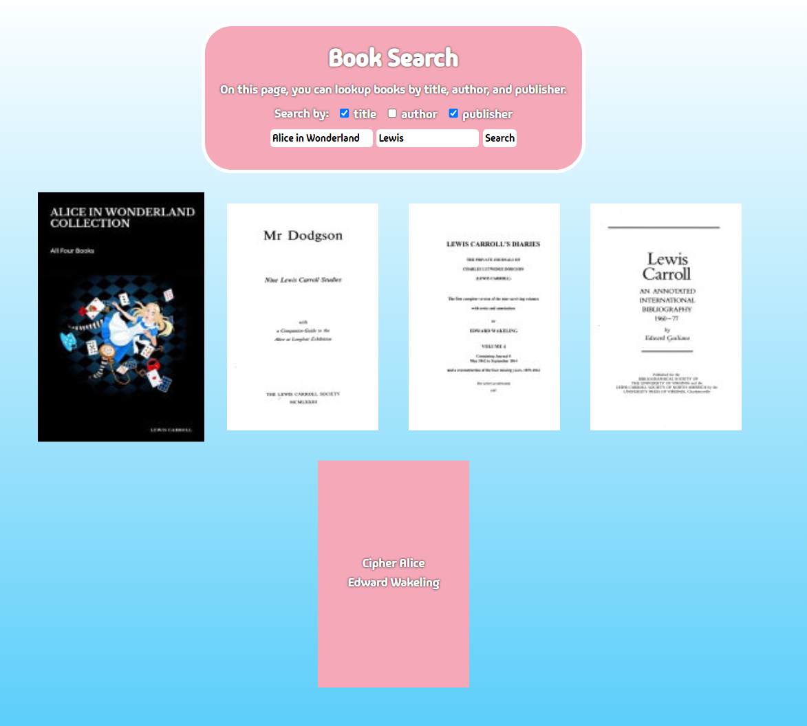

# Google Books API Search Engine

## Snippets



## Description

This project is a web application that allows users to search for books using the Google Books API. The frontend is developed with Vite React using Javascript. The application enables users to search for books, view book details, and handle no-result scenarios gracefully.

### Tech Stack

- React
- Vite
- Javascript
- SCSS

## Build Steps

1.  Clone the repository.

```shell
git clone https://github.com/Abbby3/Book-Search.git
```

2.  Navigate to the directory.

```shell
cd Book-Search
```

3.  Install dependencies.

```shell
npm install
```

4.  Start the development server.

```shell
npm run dev
```

## Features

- Search for books using the Google Books API.
- Display a grid of books with image, author, title, and description.
- Responsive design using Flexbox.
- User feedback when no book results are found.
- Structured and reusable code with SCSS for styling.

## Future Goals

- Fixed book modal and information scroll.
- Improved form validation and date formatting.
